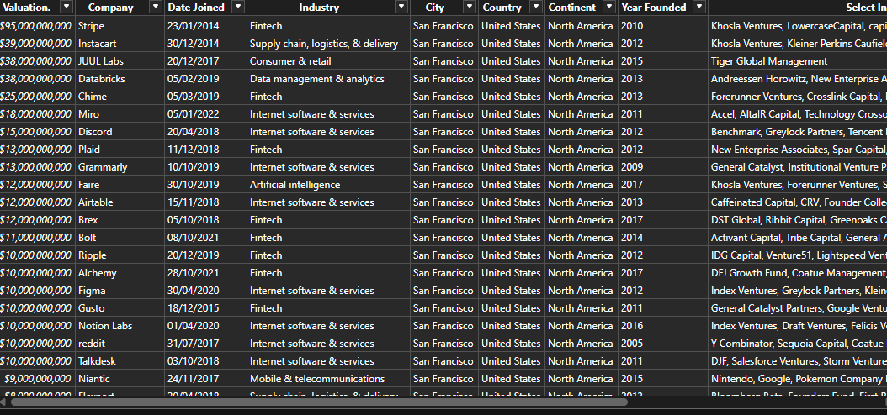
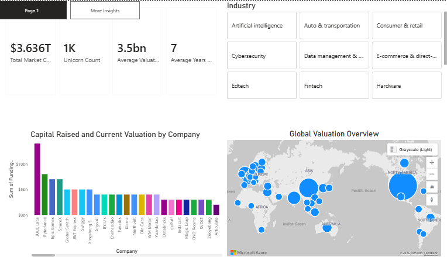

# The-Billion-Dollar-Club

## Executive Summary
The Billion Dollar Club Dashboard is a strategic investment tool designed for Senior Partners and Venture Capitalists to analyze and navigate the global landscape of "Unicorn" companies (startups valued over $1B).By transforming raw data into actionable intelligence, the dashboard empowers decision-makers to spot macroeconomic trends, mitigate risk, and identify high-value investment opportunities.

## Business Context
In the high-stakes world of Venture Capital (VC) and Private Equity, identifying the next breakout success requires moving past market noise to find concrete data patterns. "Unicorn" companies, private startups valued at $1 billion or more, represent the apex of high-growth entrepreneurship. However, as macroeconomic conditions shift, the dynamics of how these companies grow, where they emerge, and how efficiently they use capital are changing rapidly.

## Objectives
This report addresses the following key questions:
- Where are the global hotspots for innovation? (Which countries hold the geographic power in the startup ecosystem?)
- How fast do these high-growth companies typically scale to a $1 billion valuation?
- How many opportunities (companies) currently exist in this space?

## Data Overview
The analysis is based on a consolidated dataset of approximately 1074 companies and 10 columns, including the years they were founded and the year they attained the billion dollar stautus.

## Data Preview

## Data Cleaning and Transformation
Deduplicated the dataset using Power Query to ensure data integrity.
Filtered out null values to eliminate incomplete records.
Standardized column headers for improved clarity and readability.

## Detailed Findings & Analysis
### Key Performance Indicators
- **Total Market Value**: Out of the 1,000+ companies analyzed, the entire unicorn market is worth a massive $3.36 trillion.
- **Average Deal Value**: The typical price tag or average valuation for a company in this club is $3.1 billion.
- **Speed to Scale**: On average, it takes a startup 7 years of hard work to hit that coveted $1 billion milestone.

## **Billion-Dollar-Club-Insight**

### Top Market Performers per Total Valuation 
- ByteDance leads the global pack as the world's most valuable unicorn, commanding a massive $180 billion valuation.
- SpaceX and Shein are tied for the second-highest spot, both reaching a milestone valuation of $100 billion.
- Stripe closely follows as a top market leader, holding a powerful $95 billion valuation.

## **Recommendations**
Allocate a specific percentage of the fund to emerging innovation hubs outside of traditional mega-markets.While dominant countries hold the majority of the $3.36 trillion market cap, utilizing the global valuation map will reveal secondary geographic clusters where high-value deals are less competitive and entry valuations may be lower.

## **Tools Used**
- **Power BI**: Data cleaning, transformation, data analysis and visualization.

## **Conclusion**
The development of the Billion Dollar Club Dashboard successfully bridges the gap between raw, unstructured market data and strategic investment intelligence for Senior Partners and Venture Capitalists. By executing a meticulous data cleaning and transformation pipeline within Power Query, a raw dataset of approximately 1,074 companies was successfully normalized, structured, and optimized for high-performance modeling.
